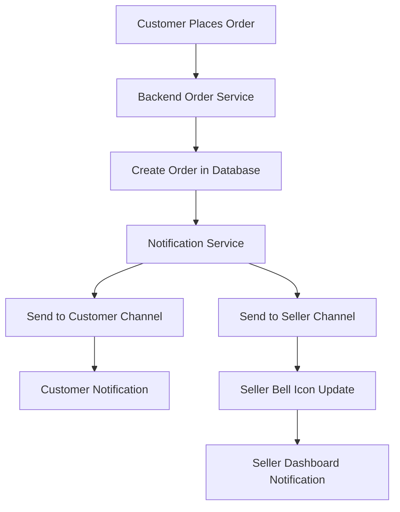

# 📚 E-Commerce Platform Codebase Documentation

## 🏗️ Project Overview

This is a full-stack e-commerce platform built with **NestJS** (backend) and **Next.js 15** (frontend), featuring real-time notifications, user authentication, and comprehensive seller/admin management.

### 🎯 Key Features
- Multi-role authentication (Customer, Seller, Admin)
- Real-time order notifications with Pusher WebSockets
- Image upload and serving system
- Seller dashboard with analytics
- Admin management panel
- Shopping cart and order management
- Product catalog with image gallery

---

## 📁 Project Structure

```
e-commerce_project/
├── e-commerce_backend/     # NestJS API Server
├── e-commerce_frontend/    # Next.js Client Application
└── Documentation Files    # Setup guides and API docs
```

---

## 🔧 Backend Architecture (NestJS)

### 📂 Core Structure
```
src/
├── main.ts                 # Application entry point
├── app.module.ts           # Root module
├── data-source.ts          # TypeORM database configuration
├── auth/                   # Authentication & Authorization
├── users/                  # User management
├── seller/                 # Seller-specific operations
├── customer/               # Customer-specific operations
├── admin/                  # Admin management
├── product/                # Product catalog management
├── notification/           # Real-time notification system
├── mailler/                # Email service integration
└── migration/              # Database migrations
```

### 🔐 Authentication System

#### **Files:**
- `auth/auth.service.ts` - Core authentication logic
- `auth/auth.controller.ts` - Authentication endpoints
- `auth/jwt.strategy.ts` - JWT token validation
- `auth/roles.guard.ts` - Role-based access control

#### **Key Features:**
```typescript
// Role-based authentication
enum UserRole {
  CUSTOMER = 'customer',
  SELLER = 'seller', 
  ADMIN = 'admin'
}

// JWT Strategy with role validation
@Injectable()
export class JwtAuthGuard extends AuthGuard('jwt') {
  // Validates JWT tokens and user roles
}
```

#### **Endpoints:**
- `POST /auth/register` - User registration
- `POST /auth/login` - User authentication
- `GET /auth/profile` - Get user profile
- `POST /auth/refresh` - Refresh JWT token

### 📦 Product Management

#### **Files:**
- `product/product.service.ts` - Product business logic
- `product/product.controller.ts` - Product API endpoints
- `product/entities/product.entity.ts` - Product data model

#### **Key Features:**
```typescript
@Entity('products')
export class Product {
  @PrimaryGeneratedColumn()
  id: number;

  @Column()
  name: string;

  @Column('decimal')
  price: number;

  @Column()
  sellerId: number;

  @OneToMany(() => ProductImage, productImage => productImage.product)
  images: ProductImage[];
}
```

#### **Image System:**
- Multiple images per product
- Static file serving from `uploads/images/`
- Automatic image URL generation
- Image upload validation and processing

### 🔔 Notification System

#### **Files:**
- `notification/notification.service.ts` - Notification business logic
- `notification/notification.controller.ts` - Notification API

#### **Pusher Integration:**
```typescript
@Injectable()
export class NotificationService {
  constructor(
    @Inject('PUSHER') private pusher: Pusher
  ) {}

  // Send notification to specific user
  async sendToUser(userId: number, notification: any) {
    await this.pusher.trigger(`user-${userId}`, 'notification-order', notification);
  }

  // Send to role-based channel
  async sendToRole(role: string, notification: any) {
    await this.pusher.trigger(`role-${role}`, 'notification-system', notification);
  }
}
```

#### **Channel Strategy:**
- `user-{userId}` - User-specific notifications
- `role-{role}` - Role-based broadcasts (seller, admin)
- `broadcast` - System-wide announcements

### 🛒 Order Management

#### **Files:**
- `order/order.service.ts` - Order processing logic
- `order/order.controller.ts` - Order API endpoints

#### **Order Flow:**
```typescript
async createOrder(createOrderDto: CreateOrderDto, userId: number) {
  // 1. Validate products and stock
  // 2. Calculate totals and create order
  // 3. Create order items for each seller
  // 4. Process payment information
  // 5. Send notifications to customer and sellers
  
  await this.notificationService.notifyOrderPlaced(completeOrder);
}
```

### 🗄️ Database Configuration

#### **TypeORM Setup:**
```typescript
// data-source.ts
export const AppDataSource = new DataSource({
  type: 'postgres',
  host: process.env.DB_HOST,
  port: parseInt(process.env.DB_PORT),
  username: process.env.DB_USERNAME,
  password: process.env.DB_PASSWORD,
  database: process.env.DB_NAME,
  entities: [__dirname + '/**/*.entity{.ts,.js}'],
  migrations: [__dirname + '/migration/*{.ts,.js}'],
  synchronize: false, // Use migrations in production
});
```

---

## 🎨 Frontend Architecture (Next.js 15)

### 📂 Core Structure
```
src/
├── app/                    # App Router (Next.js 15)
│   ├── layout.tsx         # Root layout with providers
│   ├── page.tsx           # Home page
│   ├── admin/             # Admin dashboard pages
│   ├── seller/            # Seller dashboard pages
│   ├── orders/            # Order management pages
│   └── products/          # Product catalog pages
├── components/            # Reusable UI components
├── contexts/              # React Context providers
├── hooks/                 # Custom React hooks
├── utils/                 # Utility functions
└── lib/                   # External service integrations
```

### 🎯 Context Architecture

#### **Authentication Context:**
```typescript
// contexts/AuthContextNew.tsx
interface AuthContextType {
  user: User | null;
  login: (credentials: LoginCredentials) => Promise<void>;
  logout: () => void;
  loading: boolean;
  isAuthenticated: boolean;
}

export const AuthProvider: React.FC<{ children: ReactNode }> = ({ children }) => {
  // JWT token management
  // User state management
  // Role-based route protection
};
```

#### **Notification Context:**
```typescript
// contexts/NotificationContext.tsx
interface NotificationContextType {
  notifications: Notification[];
  unreadCount: number;
  markAsRead: (id: string) => void;
  markAllAsRead: () => void;
  isConnected: boolean;
}

export const NotificationProvider: React.FC = ({ children, userId, userRole }) => {
  // Pusher WebSocket connection
  // Real-time notification handling
  // Notification persistence
};
```

### 🔔 Real-Time Notification System

#### **Enhanced Seller Notification Panel:**
```typescript
// components/EnhancedSellerNotificationPanel.tsx
export default function EnhancedSellerNotificationPanel() {
  const { notifications, unreadCount, markAsRead } = useNotifications();
  
  // Features:
  // - Bell icon with unread count badge
  // - Sound notifications for new orders
  // - Persistent notifications until marked as read
  // - Rich notification UI with action buttons
  // - Real-time updates via Pusher
}
```

#### **Pusher Integration:**
```typescript
// Pusher connection setup
const pusher = new Pusher(process.env.NEXT_PUBLIC_PUSHER_KEY, {
  cluster: process.env.NEXT_PUBLIC_PUSHER_CLUSTER,
  encrypted: true,
});

// Channel subscriptions
const userChannel = pusher.subscribe(`user-${userId}`);
const roleChannel = pusher.subscribe(`role-${userRole}`);

// Event listeners
userChannel.bind('notification-order', handleNotification);
roleChannel.bind('notification-system', handleSystemNotification);
```

### 🛡️ Route Protection

#### **Auth Guards:**
```typescript
// hooks/useAuthGuard.ts
export const useSellerGuard = () => {
  const { user, loading } = useAuth();
  
  const isAuthorized = user?.role === 'seller' && user?.isVerified;
  
  return { user, loading, isAuthorized };
};
```

#### **Protected Routes:**
- `/seller/*` - Seller-only access
- `/admin/*` - Admin-only access
- `/orders/*` - Authenticated users only

### 🎨 UI Components

#### **Navigation System:**
```typescript
// components/Navigation.tsx
export default function Navigation() {
  // Role-based navigation menu
  // Authentication status display
  // Responsive design for mobile/desktop
}
```

#### **Product Display:**
```typescript
// components/ProductCard/ProductCard.tsx
export default function ProductCard({ product }) {
  // Product image carousel
  // Price formatting
  // Add to cart functionality
  // Seller information display
}
```

---

## 🔄 Data Flow & API Integration

### 📡 API Communication

#### **Axios Configuration:**
```typescript
// lib/axios.ts
const api = axios.create({
  baseURL: process.env.NEXT_PUBLIC_API_URL,
  timeout: 10000,
});

// Request interceptor for JWT tokens
api.interceptors.request.use((config) => {
  const token = localStorage.getItem('access_token');
  if (token) {
    config.headers.Authorization = `Bearer ${token}`;
  }
  return config;
});
```

#### **API Services:**
```typescript
// utils/api.ts
export const sellerDashboardAPI = {
  getDashboardOverview: () => api.get('/seller/dashboard/overview'),
  getOrders: () => api.get('/seller/orders'),
  updateOrderStatus: (orderId: number, status: string) => 
    api.patch(`/seller/orders/${orderId}/status`, { status }),
};
```

### 🔄 Real-Time Updates Flow



---

## 🚀 Deployment & Environment

### 🔧 Environment Variables

#### **Backend (.env):**
```env
# Database
DB_HOST=localhost
DB_PORT=5432
DB_USERNAME=postgres
DB_PASSWORD=your_password
DB_NAME=ecommerce_db

# JWT
JWT_SECRET=your-secret-key
JWT_EXPIRES_IN=24h

# Pusher
PUSHER_APP_ID=your-app-id
PUSHER_KEY=your-key
PUSHER_SECRET=your-secret
PUSHER_CLUSTER=your-cluster

# Email
MAIL_HOST=smtp.gmail.com
MAIL_USER=your-email@gmail.com
MAIL_PASSWORD=your-app-password
```

#### **Frontend (.env.local):**
```env
NEXT_PUBLIC_API_URL=http://localhost:5000
NEXT_PUBLIC_PUSHER_KEY=your-pusher-key
NEXT_PUBLIC_PUSHER_CLUSTER=your-cluster
NEXT_PUBLIC_APP_NAME=E-Commerce Platform
```

### 🐳 Development Setup

#### **Backend Setup:**
```bash
cd e-commerce_backend
npm install
npm run migration:run
npm run start:dev
```

#### **Frontend Setup:**
```bash
cd e-commerce_frontend
npm install
npm run dev
```

---

## 🧪 Testing & Debugging

### 🔍 Notification System Testing

#### **Debug Logging:**
The notification system includes comprehensive logging:
- Pusher connection status
- Channel subscription confirmation
- Notification receipt and processing
- User role and ID verification

#### **Test Scripts:**
```bash
# Test seller notification manually
node test-seller-notification.js

# Test product endpoints
./test-product-endpoints.sh

# Test seller operations
./test-seller-operations.sh
```

### 🐛 Common Issues & Solutions

#### **1. Notifications Not Appearing:**
- **Check**: User role and ID in browser console
- **Verify**: Pusher channel subscriptions
- **Confirm**: Backend notification sending logic

#### **2. Image Loading Issues:**
- **Check**: Static file serving configuration
- **Verify**: Image upload paths
- **Confirm**: CORS settings for image requests

#### **3. Authentication Problems:**
- **Check**: JWT token validity
- **Verify**: Role-based access controls
- **Confirm**: Token storage and retrieval

---

## 📊 Performance Considerations

### ⚡ Optimization Strategies

#### **Frontend:**
- Next.js App Router for optimized routing
- Image optimization with Next.js Image component
- Component lazy loading
- Efficient state management with React Context

#### **Backend:**
- Database query optimization with proper indexing
- Caching strategies for frequently accessed data
- Connection pooling for database connections
- Rate limiting for API endpoints

#### **Real-time Features:**
- Efficient Pusher channel management
- Selective notification delivery
- WebSocket connection cleanup
- Notification persistence optimization

---

## 🔮 Future Enhancements

### 🎯 Planned Features
- [ ] Mobile app with React Native
- [ ] Advanced analytics dashboard
- [ ] Multi-language support
- [ ] Payment gateway integration
- [ ] Inventory management system
- [ ] Customer review and rating system
- [ ] Advanced search and filtering
- [ ] Recommendation engine

### 🛠️ Technical Improvements
- [ ] Microservices architecture
- [ ] Docker containerization
- [ ] CI/CD pipeline setup
- [ ] Automated testing suite
- [ ] Performance monitoring
- [ ] Security audit and hardening

---

## 📝 Contributing Guidelines

### 🤝 Development Workflow
1. Create feature branch from `main`
2. Implement changes with proper testing
3. Update documentation as needed
4. Submit pull request with detailed description
5. Code review and merge approval

### 📋 Code Standards
- Follow TypeScript strict mode
- Use ESLint and Prettier for code formatting
- Write comprehensive JSDoc comments
- Implement proper error handling
- Include unit tests for new features

---

## 📞 Support & Documentation

### 🔗 Additional Resources
- [API Documentation](./API_EXAMPLES.md)
- [Pusher Setup Guide](./PUSHER_SETUP_GUIDE.md)
- [Notification System Guide](./NOTIFICATION_SYSTEM_DOCUMENTATION.md)
- [Image Upload Documentation](./IMAGE_UPLOAD_DOCUMENTATION.md)

### 🐛 Issue Reporting
For bugs or feature requests, please create an issue with:
- Detailed description of the problem
- Steps to reproduce
- Expected vs actual behavior
- Environment information (OS, browser, Node.js version)

---

*Last Updated: September 17, 2025*
*Version: 1.0.0*